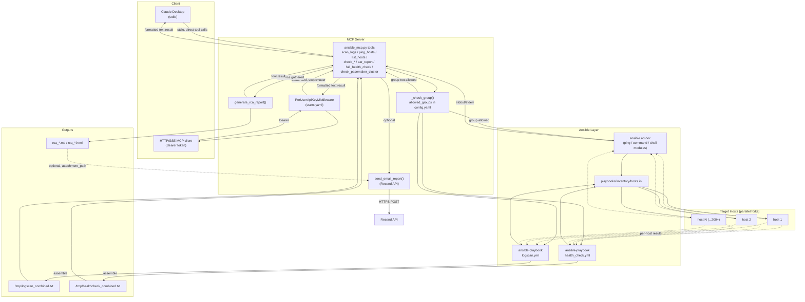

# Architecture

End-to-end flow of a request through `ansible-log-mcp`, from client to
target hosts and back, including the optional RCA report + email path.

## Components

- **Clients** — Claude Desktop (stdio) or any HTTP/SSE MCP client (Bearer-token auth)
- **MCP server** — `server/ansible_mcp.py` (tool definitions) and `server/ansible_mcp_http.py` (HTTP/SSE transport + per-user auth, imports the same tools)
- **Config** — `config.yaml` (allowed groups, paths, defaults), `users.yaml` (API keys, HTTP transport only)
- **Ansible layer** — `ansible`/`ansible-playbook` CLI, `playbooks/inventory/hosts.ini`, `playbooks/logscan.yml`, `playbooks/health_check.yml`
- **Targets** — hosts in the inventory group (parallel forks, default 50)
- **Outputs** — combined per-host report files in `/tmp`, optional RCA markdown/HTML report, optional email via Resend API

## Diagram

## Request lifecycle (example: `scan_logs`)

1. Client calls the `scan_logs` tool (Claude Desktop over stdio, or an HTTP client with a valid `Authorization: Bearer <key>` matched against `users.yaml`).
2. `_check_group()` rejects the call if `target_group` isn't in `config.yaml`'s `allowed_groups`.
3. The server shells out to `ansible-playbook playbooks/logscan.yml` with `target_group`, `search_pattern`, `log_path` as extra-vars, against `playbooks/inventory/hosts.ini`, forking up to `defaults.forks` connections in parallel.
4. Each target host greps its log file; the playbook writes one per-host file to `/tmp`, then Ansible's `assemble` module concatenates them into `/tmp/logscan_combined.txt`.
5. The server reads that combined file and returns it as the tool result, up the same path it came in.

`full_health_check` follows the same shape via `health_check.yml`, collapsing uptime/memory/disk/top/systemd/log/pacemaker/sar checks into a single remote shell call per host to save SSH round trips. `check_uptime`, `check_memory`, `ping_hosts`, etc. skip the playbook/assemble step entirely and go straight through an `ansible` ad-hoc command.

`generate_rca_report` and `send_email_report` sit downstream of evidence-gathering tools — they don't touch the inventory at all, just format/save/email whatever the model passes in.
