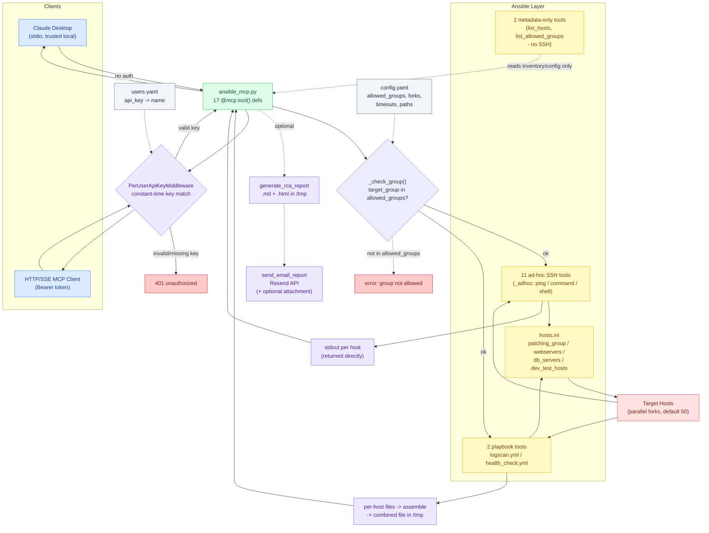

# Architecture

End-to-end flow of a request through `ansible-log-mcp`, from client to
target hosts and back, including transport/auth, the Ansible execution
layer, and the optional RCA report + email path.

## Components

### Clients
- **Claude Desktop** — talks to `server/ansible_mcp.py` over stdio, no auth (trusted local process).
- **HTTP/SSE MCP client** — any MCP-compatible client hitting `server/ansible_mcp_http.py` over the network, authenticated per-request with `Authorization: Bearer <api_key>`.

### MCP server
- **`server/ansible_mcp.py`** — defines all 17 `@mcp.tool()` functions and owns the actual Ansible execution logic. This is the source of truth; it's usable standalone over stdio.
- **`server/ansible_mcp_http.py`** — thin wrapper: `from ansible_mcp import mcp` re-exports every tool unchanged, then layers on:
  - `PerUserApiKeyMiddleware` — raw ASGI middleware (not `BaseHTTPMiddleware`, which doesn't handle long-lived SSE streams) that requires a valid Bearer token on every request except `/.well-known/*` and `/register`. Keys are compared with `secrets.compare_digest` against *every* known key (not short-circuited) to avoid leaking which prefix matched via timing.
  - `TransportSecuritySettings` — DNS-rebinding protection; only Host headers in `ANSIBLE_MCP_ALLOWED_HOSTS` (or the built-in localhost/LAN default) are accepted.
  - Structured logging of `user=<name>` (not the raw key) on every request, so access is auditable per teammate and one person's key can be revoked without rotating everyone else's.

### Config
- **`config.yaml`** — `allowed_groups` (the inventory-group allowlist every tool call is checked against via `_check_group()`), `playbook_dir`/`playbook_file`/`health_playbook_file`, `inventory_path`, `defaults` (`log_path`, `forks: 50`, `timeout_seconds: 300`), `output` (tmp dir + combined-file paths), `email.from_address`.
- **`users.yaml`** (HTTP transport only, gitignored) — `{name, api_key}` pairs loaded once at startup by `load_users()`; missing file or empty list raises at import time rather than serving unauthenticated.

### Ansible layer
- **`ansible`/`ansible-playbook` CLI**, invoked via `subprocess` in `_run()`/`_adhoc()`, both instrumented with a `timeout_seconds` kill switch.
- **`playbooks/inventory/hosts.ini`** — static inventory, grouped into `patching_group`, `webservers`, `db_servers`, `dev_test_hosts` (the same names `config.yaml` allowlists).
- **`playbooks/logscan.yml`** — used by `scan_logs`.
- **`playbooks/health_check.yml`** — used by `full_health_check`.
- Every other tool skips playbooks entirely and runs a single `ansible ... -m <module> -a <args>` ad-hoc command via `_adhoc()`.

### Targets
Hosts in the selected inventory group, fanned out to in parallel — `forks: 50` by default, capped by `timeout_seconds` per run.

### Outputs
- Ad-hoc tools return Ansible's stdout directly, per host.
- Playbook tools write one file per host to `/tmp`, then Ansible's `assemble` module concatenates them into a single combined file (`logscan_combined.txt` / `healthcheck_combined.txt`) that the server reads back and returns.
- `generate_rca_report` writes a Markdown **and** HTML report to `/tmp` and returns both paths plus the full text.
- `send_email_report` sends via the **Resend API** (`RESEND_API_KEY` env var + `email.from_address` from `config.yaml`), with optional HTML body and file attachment.

## Tool inventory (17 tools)

| Tool | Execution path | Notes |
|---|---|---|
| `ping_hosts` | ad-hoc `ping` | connectivity check |
| `list_hosts` | inventory read | no SSH |
| `list_allowed_groups` | config read | no SSH |
| `check_uptime` | ad-hoc `command: uptime` | |
| `check_memory` | ad-hoc `command: free -h` | |
| `check_disk` | ad-hoc `command: df -h` | |
| `check_load_top` | ad-hoc `shell: ps aux --sort=-<field>` | sortable, count-limited |
| `check_failed_services` | ad-hoc `shell: systemctl --failed` | key RCA first-check |
| `check_service_status` | ad-hoc `shell: systemctl status <svc>` | |
| `check_recent_reboots` | ad-hoc `shell: last reboot -F` | |
| `check_cluster_logs` | ad-hoc `shell` (log tail) | |
| `check_pacemaker_cluster` | ad-hoc `shell` (`pcs status` et al.) | |
| `sar_report` | ad-hoc `shell` (`sar` per metric) | cpu/mem/disk/etc. |
| `scan_logs` | **playbook** `logscan.yml` + `assemble` | regex grep across a group |
| `full_health_check` | **playbook** `health_check.yml` + `assemble` | uptime+mem+disk+top+systemd+logs+pacemaker+sar in one remote shell call per host, to save SSH round trips |
| `generate_rca_report` | local formatting only | sorts events chronologically, writes `.md` + `.html` to `/tmp` |
| `send_email_report` | Resend API call | attaches the RCA file, optional HTML body |

`generate_rca_report` and `send_email_report` never touch the inventory — they're pure downstream formatting/delivery steps that consume whatever the model passes in from the evidence-gathering tools above.

## Diagram

Solid arrows are the required path; dashed arrows are optional (RCA/email) or rejection branches (invalid key, disallowed group).

## Request lifecycle (example: `scan_logs`)

1. Client calls the `scan_logs` tool (Claude Desktop over stdio, or an HTTP client with a valid `Authorization: Bearer <key>` matched against `users.yaml` — checked with a constant-time comparison against every key, and logged by username).
2. `_check_group()` rejects the call if `target_group` isn't in `config.yaml`'s `allowed_groups`.
3. The server shells out to `ansible-playbook playbooks/logscan.yml` with `target_group`, `search_pattern`, `log_path` as extra-vars, against `playbooks/inventory/hosts.ini`, forking up to `defaults.forks` connections in parallel, bounded by `defaults.timeout_seconds`.
4. Each target host greps its log file; the playbook writes one per-host file to `/tmp`, then Ansible's `assemble` module concatenates them into `/tmp/logscan_combined.txt`.
5. The server reads that combined file and returns it as the tool result, up the same path it came in.

`full_health_check` follows the same shape via `health_check.yml`, collapsing uptime/memory/disk/top/systemd/log/pacemaker/sar checks into a single remote shell call per host to save SSH round trips. `check_uptime`, `check_memory`, `ping_hosts`, and the other 10 ad-hoc tools skip the playbook/assemble step entirely and go straight through a single `ansible ... -m <module>` command.

`generate_rca_report` and `send_email_report` sit downstream of evidence-gathering tools — they don't touch the inventory at all, just format/save/email whatever the model passes in as structured events, root cause, and resolution.

## Failure/auth paths worth knowing

- **Bad `target_group`** — rejected before any SSH connection is attempted (`_check_group()` fails fast against `config.yaml`).
- **Missing/invalid Bearer token** (HTTP transport only) — `401 {"error": "unauthorized"}`, logged as a warning with the path but not the presented key.
- **Host header not allowlisted** (HTTP transport only) — rejected by `TransportSecuritySettings` before it reaches the auth middleware at all; override via `ANSIBLE_MCP_ALLOWED_HOSTS`.
- **Ansible command exceeds `timeout_seconds`** — `_run()` kills it and returns a timeout error instead of hanging the tool call.
- **`RESEND_API_KEY` unset** — `send_email_report` returns a descriptive error instead of a silent failure.
